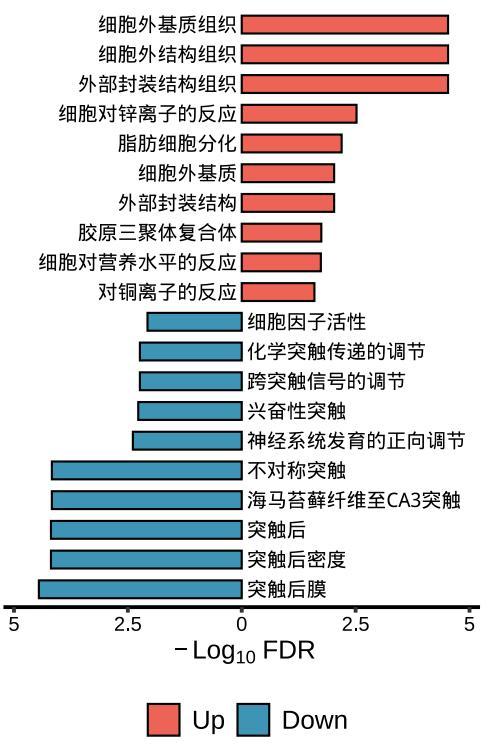

## :bar_chart: Overview
## Integrate analysis and visualization for bioinformatic enrichment analyzer
BioEnricher lies in addressing two issues: firstly, it facilitates the seamless integration for enrichment analysis, encompassing diverse functionalities such as GO, KEGG, WikiPathways, Reactome, MsigDB, Disease Ontology, Cancer Gene Network, DisGeNET, CellMarker, and CMAP (drugs); secondly, it encapsulates advanced visualization functions, streamlining the process for faster and more convenient data presentation.

## :arrow_double_down: Installation
**You can install the released version of BioEnricher from Github with:**
```R
devtools::install_github("Zaoqu-Liu/BioEnricher")
```
## :beginner: Examples
### Get an interested gene list (for ORA) or an order-ranked geneList (for GSEA)
**You should identify an interested gene list or an order-ranked geneList by employing differential analysis or other methods.**
```R
library(airway)
library(DESeq2)
library(tidyverse)
library(clusterProfiler)
library(org.Hs.eg.db)
data(airway)
se <- airway
se$dex <- relevel(se$dex, "untrt") 
res <- DESeqDataSet(se, design = ~ cell + dex)%>%
  estimateSizeFactors()%>%DESeq()%>%
  results()%>%as.data.frame()%>%na.omit()
ann <- bitr(rownames(res),'ENSEMBL','SYMBOL',org.Hs.eg.db)
res <- merge(ann,res,by.x=1,by.y=0)%>%distinct(SYMBOL,.keep_all = T) # Very crude, just as an example
```
```R
# Define an up-regulated gene list
up.genes <- res$SYMBOL[res$log2FoldChange > 2 & res$padj < 0.05]
# Define a down-regulated gene list
down.genes <- res$SYMBOL[res$log2FoldChange < -2 & res$padj < 0.05]
```
## :paperclip: ORA
**This function will perform over-representative analysis including GO, KEGG, WikiPathways, Reactome, MsigDB, Disease Ontoloty, Cancer Gene Network, DisGeNET, CellMarker, and CMAP.**
**Set enrich.type using an enrichment analysis method mentioned above.**
```R
kegg <- lzq_ORA(
  genes = res$SYMBOL[res$log2FoldChange > 0 & res$padj < 0.05],
  enrich.type = 'KEGG'
)
```
## :paperclip: ORA.integrated
**This function will perform an integration for enrichment analysis, including GO, KEGG, WikiPathways, Reactome, MsigDB, Disease Ontology, Cancer Gene Network, DisGeNET, CellMarker, and CMAP (drugs).**
```R
library(BioEnricher)
# Integrative enrichment analysis of the up-regulated gene list
up.enrich <- lzq_ORA.integrated(
  genes = up.genes,
  background.genes = NULL,
  GO.ont = 'ALL',
  perform.WikiPathways = T,
  perform.Reactome = T,
  perform.MsigDB = T,
  MsigDB.category = 'ALL',
  perform.Cancer.Gene.Network = T,
  perform.disease.ontoloty = T,
  perform.DisGeNET = T,
  perform.CellMarker = T,
  perform.CMAP = T,
  min.Geneset.Size = 3
)
# This function will output its calculation process.
+++ Updating gene symbols...
Maps last updated on: Thu Oct 24 12:31:05 2019
+++ Transforming SYMBOL to ENTREZID...
'select()' returned 1:1 mapping between keys and columns
+++ Performing GO-ALL enrichment...
+++ Symplifying GO results...
+++ Performing KEGG enrichment...
+++ Performing Module KEGG enrichment...
+++ Performing WikiPathways enrichment...
+++ Performing Reactome pathways enrichment...
+++ Performing Disease Ontoloty enrichment...
+++ Performing Cancer Gene Network enrichment...
+++ Performing DisGeNET enrichment...
+++ Performing CellMarker enrichment...
+++ Performing MsigDB-ALL enrichment...                                               
+++ Performing CMAP enrichment...
+++ 1765 significant terms were detected...
+++ Done!
```
```R
# Integrative enrichment analysis of the down-regulated gene list
down.enrich <- lzq_ORA.integrated(
  genes = down.genes,
  background.genes = NULL,
  GO.ont = 'ALL',
  perform.WikiPathways = T,
  perform.Reactome = T,
  perform.MsigDB = T,
  MsigDB.category = 'ALL',
  perform.Cancer.Gene.Network = T,
  perform.disease.ontoloty = T,
  perform.DisGeNET = T,
  perform.CellMarker = T,
  perform.CMAP = T,
  min.Geneset.Size = 3
)
# This function will output its calculation process.
+++ Updating gene symbols...
Maps last updated on: Thu Oct 24 12:31:05 2019
+++ Transforming SYMBOL to ENTREZID...
'select()' returned 1:1 mapping between keys and columns
+++ Performing GO-ALL enrichment...
+++ Symplifying GO results...
+++ Performing KEGG enrichment...
+++ Performing Module KEGG enrichment...
+++ Performing WikiPathways enrichment...
+++ Performing Reactome pathways enrichment...
+++ Performing Disease Ontoloty enrichment...
+++ Performing Cancer Gene Network enrichment...
+++ Performing DisGeNET enrichment...
+++ Performing CellMarker enrichment...
+++ Performing MsigDB-ALL enrichment...                                               
+++ Performing CMAP enrichment...
+++ 1426 significant terms were detected...
+++ Done!
```
## :page_facing_up: Visualization for one enrichment object
**barplot**
```R
lzq_ORA.barplot1(enrich.obj = up.enrich$simplyGO)
```


**dotplot**
```R
lzq_ORA.dotplot1(enrich.obj = up.enrich$simplyGO)
```


## :page_facing_up: Visualization for two types of enrichment objects
```R
lzq_ORA.barplot2(
  enrich.obj1 = up.enrich$simplyGO,
  enrich.obj2 = down.enrich$simplyGO,
  obj.types = c('Up','Down')
)
```


### You can translate the terms in the graph into Chinese using use.Chinese = T
```R
lzq_ORA.barplot2(
  enrich.obj1 = up.enrich$simplyGO,
  enrich.obj2 = down.enrich$simplyGO,
  obj.types = c('Up','Down'),
  use.Chinese = T
)
```


**Note: use.Chinese exists all the plot functions.**


